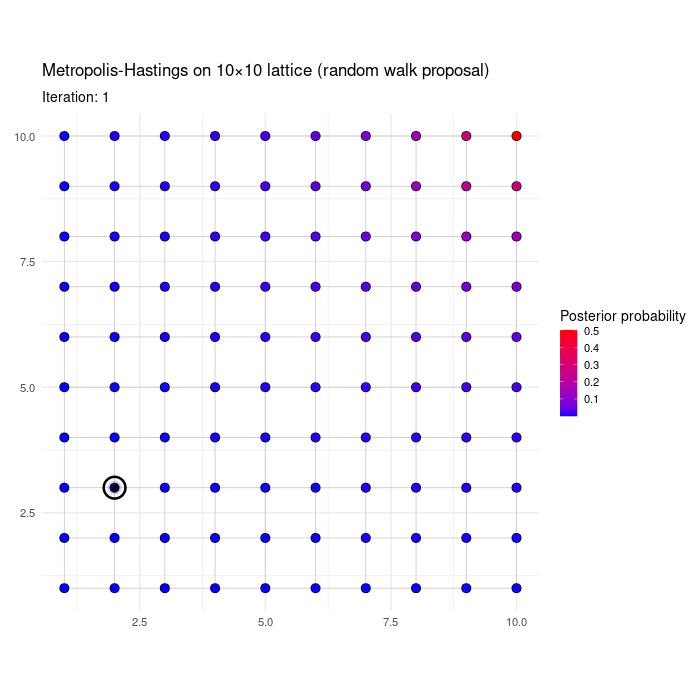
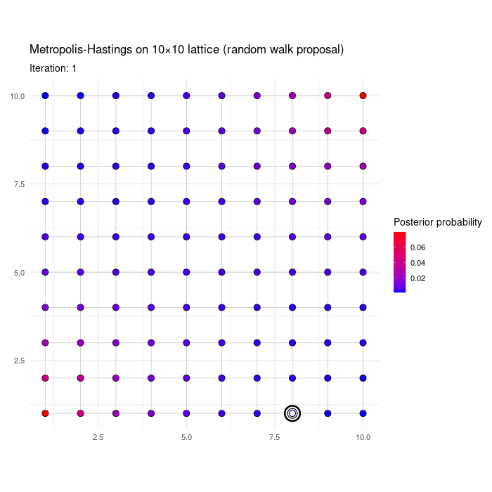

# Bayesian computation  {#bms-computation}

To summarize what we saw in Chapter \@ref(background-bms), 
after setting suitable priors on the models and parameters, we obtained two posterior distributions of interest: the posterior distribution on the models $p(\bgamma \mid \by)$ and the BMA posterior on parameters $p(\btheta \mid \by)$, where $\btheta= \{ \btheta_\gamma \}_{\gamma \in \Gamma}$ is the collection of parameters from all models. 
These are given by
\begin{align}
  p(\bgamma \mid \by)&= \frac{p(\by \mid \bgamma)p(\bgamma)}{p(\by)} \propto p(\by \mid \bgamma) p(\bgamma)
  \nonumber \\
  p(\btheta \mid \by)&= \sum_{\gamma} p(\btheta \mid \bgamma,\by) p(\bgamma \mid \by).
\nonumber
\end{align}

Therefore, one needs to compute
\begin{align}
& p(\by \mid \bgamma)= \int p(\by \mid \btheta_\gamma, \bgamma) p(\btheta_\gamma \mid \bgamma) d\btheta_\gamma
\nonumber \\
& p(\btheta_\gamma \mid \bgamma, \by)=
   \frac{p(\by \mid \btheta_\gamma, \bgamma) p(\btheta_\gamma \mid \bgamma)}{p(\by \mid \bgamma)}.
\nonumber
\end{align}

We next overview some basic notions in Bayesian computation, see for example @gamerman:2006 for a lengthier yet accessible introduction to many of the ideas discussed here, and @brooks:2011 for a handbook covering a range of applied MCMC topics.

Outside simple cases such as linear regression or additive non-linear regression with Gaussian errors (Section \@ref(gam)), neither $p(\by \mid \bgamma)$ nor $p(\btheta_\gamma \mid \bgamma,\by)$ have closed-form.
A fairly fast and often quite accurate approximation is to use Normal/Laplace approximations, and these are 
discussed in Section \@ref(bms-marglhood-approx).

The other main challenge is that, even if $p(\by \mid \bgamma)$ can be quickly computed, one may need to explore a prohibitively large model space.
Markov Chain Monte Carlo (MCMC) methods, discussed in Section \@ref(bms-mcmc)), are the standard tool for this task.
Another possible strategy is to use variational inference methods adapted to the model selection setting, e.g. as done by @carbonetto:2012 for regression problems.
The main caveat of variational methods are that they can significantly under-estimate uncertainty, and this is particularly critical for model selection and hypothesis testing problems. We illustrate this issue with two examples, where we compare MCMC to the variational approach of @carbonetto:2012 implemented in package `varbvs`.
Example \@ref(exm:variational-simulated) shows a simulated data where variational inference underestimates model uncertainty, in that posterior inclusion probabilities are closer to 0 or 1 than for MCMC. Other than that, there is a reasonable agreements between the results from both methods.
Example \@ref(exm:variational-tgfb) analyzes a colon cancer gene expression dataset from @calon:2012, and there the variational and MCMC solutions differ significantly. In fact, the findings from the latter align better with the expected biology.
These examples motivate the use of MCMC for model search, as described in Section \@ref(bms-mcmc).


::: {.example #variational-simulated}

We simulate a dataset with $n=100$, $p=200$ standard Gaussian covariates with pairwise correlations equal to 0.5.
Only the last 4 regression are truly non-zero.

```{r}
set.seed(1234)
n <- 100; p <- 200  
beta= c(rep(0, p - 4), -2/3, 1/3, 2/3, 1) #true parameters
S <- diag(length(beta))
S[upper.tri(S)] <- S[lower.tri(S)] <- 0.5
x <- mvtnorm::rmvnorm(n=n,sigma=S)
y <- x %*% beta + rnorm(n)
df <- data.frame(y, x)
```

We obtain MCMC estimates of BMA posterior means $E(\beta_j \mid \by)$ and posterior inclusion probabilities $P(\beta_j \neq 0 \mid \by)$ using `modelSelection`, and analogous variational estimates using `varbvs`. For illustration, in both cases we set a Binomial model prior with 0.1 prior inclusion probability, and a Gaussian shrinkage prior on parameters with unit variance.


```{r}
priorvar <- 1
pc <- normalidprior(priorvar)
pm <- modelbinomprior(0.1)
fit_ms <- modelSelection(y=y, x=x, priorCoef=pc, priorModel=pm, niter=1000, verbose=FALSE)
b <- coef(fit_ms)
b <- b[!(rownames(b) %in% c('intercept','phi')),]
```


```{r, message=FALSE}
logodds <- log10(0.1/0.9)
fit_vb <- varbvs(X=x, Z=NULL, y=y, family= "gaussian", sa=priorvar, logodds=logodds, verbose=FALSE)
```

```{r}
df <- data.frame(beta= beta,
                 postmean_mcmc= b[,'estimate'], 
                 pip_mcmc= b[,'margpp'],
                 postmean_vb= fit_vb$beta,
                 pip_vb= fit_vb$pip)
```


Comparing $P(\beta_j \neq 0 \mid \by)$ between the two methods shows that they both identify the same set of high posterior inclusion probability variables: 3 have posterior inclusion probability > 0.9, and the associated data-generating $\beta_j \neq 0$ for the 3 of them.
However, the plot below that the variational inclusion probabilities are much closer to 0 for the remaining variables than their MCMC counterparts.

```{r}
dplyr::filter(df, pip_mcmc > 0.9)
```


```{r}
ggplot(df, aes(x=pip_mcmc, y=pip_vb)) +
  geom_point() +
  geom_abline() +
  labs(x='Posterior inclusion probability (MCMC)',
       y='Posterior inclusion probability (VB)')
```


We may also compare the BMA posterior means, in this example the variational and MCMC solutions are similar.

```{r}
ggplot(df, aes(x=postmean_mcmc, y=postmean_vb)) +
  geom_point() +
  geom_abline() +
  labs(x= bquote(E(beta[j] ~ "|" ~ y) (MCMC)),
       y= bquote(E(beta[j] ~ "|" ~ y) (variational)))
```


:::


::: {.example #variational-tgfb}

@calon:2012 compared mice where gene TGFB was silenced to mice where it was not, found a list of 172 genes that were associated to TGFB, and showed that TGFB plays a crucial role in colon cancer progression.
We take their data as subsequently analyzed in @rognon:2025empirical, 
which contains the expression of TGFB plus $p=1,000$ genes (including the 172 genes from the mouse list) for $n=262$ human patients.
The goal is to regress TGFB on the other genes, which is of interest given the importance of TGFB in colon cancer progression.
We also wish to assess whether the 172 genes identified from the mouse study are more likely to be associated to TGFB, as would be expected biologically and as shown in @rognon:2025empirical.
Both TGFB and the other genes were standardized to zero mean and unit variance.

We load the data and use `modelSelection` for MCMC-based inference and `varbvs` for variational inference.
In both we use a Gaussian shrinkage prior on parameters with unit variance.
In `varbvs` we use a Binomial model prior with prior inclusion probabilty 0.1, and for convenience in `modelSelection` we use a Beta-Binomial model prior as it runs faster than the Binomial prior, but our subsequent discussion continues to apply if one uses the Binomial prior as well.


```{r}
x <- read.table("data/tgfb.txt", header=TRUE)
shortlist <- as.character(read.table("data/tgfb_mouse_shortlist.txt", header=TRUE)[,1])
y= x[,1]   #TGFB expression (outcome)
x= x[,-1]  #covariates
inshort= (colnames(x) %in% shortlist)
```


```{r}
priorvar <- 1
pc <- normalidprior(priorvar)
pm <- modelbbprior()
fit_ms <- modelSelection(y=y, x=x, priorCoef=pc, priorModel=pm, niter=1000, verbose=FALSE)
b <- coef(fit_ms)
b <- b[!(rownames(b) %in% c('intercept','phi')),]
```


```{r}
logodds <- log10(0.1/0.9)
fit_vb <- varbvs(X=as.matrix(x), Z=NULL, y=y, family= "gaussian", sa=priorvar, logodds=logodds, verbose=FALSE)
```


```{r}
df <- data.frame(inshort= inshort,
                 postmean_mcmc= b[,'estimate'], 
                 pip_mcmc= b[,'margpp'],
                 postmean_vb= fit_vb$beta,
                 pip_vb= fit_vb$pip)
```


The marginal posterior probabilities estimated from both methods differ drastically: the variational estimates are much closer to 0 or 1 than those from MCMC, significantly underestimating model uncertainty.
The BMA parameter estimates are also very different.


```{r two-plots, fig.show='hold', out.width='50%'}
ggplot(df, aes(x=pip_mcmc, y=pip_vb)) +
  geom_point() +
  geom_abline() +
  labs(x='Posterior inclusion probability (MCMC)',
       y='Posterior inclusion probability (VB)')

ggplot(df, aes(x=postmean_mcmc, y=postmean_vb)) +
  geom_point() +
  geom_abline() +
  labs(x= bquote(E(beta[j] ~ "|" ~ y) (MCMC)),
       y= bquote(E(beta[j] ~ "|" ~ y) (variational)))
```

From purely a Bayesian point of view this shows variational inference may provide a poor approximation to the desired posterior. This is different from saying that the exact Bayesian solution provides better inference than the variational one, in terms of detecting the genes that are truly associated with TGFB.
As an additional check in this direction, we compare the average posterior inclusion probability between genes that were inside/outside the mouse list. For the MCMC estimates there is a big difference, roughly 0.023/0.007 = 3.3, which aligns with what's expected biologically. For the variational estimates the difference is much smaller.


```{r}
group_by(df, inshort) |>
  summarize(mean(pip_mcmc), mean(pip_vb))
```


:::


## Marginal likelihoods and model-specific posteriors {#bms-marglhood-approx}

The marginal likelihood in \@ref(eq:bms-marglhood) has a closed-form expression in some instances, mainly regression with Gaussian errors (e.g., linear regression, non-linear additive regression) with conjugate parameter priors.
Recall that the marginal likelihood for model $\bgamma$ is
\begin{align*}
p(\by \mid \gamma)= \int p(\by \mid \btheta_\gamma, \gamma) p(\btheta_\gamma \mid \gamma) d\btheta_\gamma.
\end{align*}

Outside these special cases, a numerical approximation is required.
The `modelSelection` function implements some such approximations, and their use can be specified with the argument `method`.
For example, set `method=='Laplace'` to use Laplace approximations, described next.
If `method` is not specified, `modelSelection` selects a sensible default.

Laplace approximations are fairly computationally efficient, and also highly accurate as $n$ grows [@kass:1990].
Consider the integral
\begin{align}
\int e^{f(\btheta_\gamma)} d\btheta_\gamma 
\nonumber
\end{align}
where $\btheta_\gamma \in \mathbb{R}^{d_\gamma}$ and $d_\gamma= \mbox{dim}(\btheta_\gamma)$ is the number of parameters.
Let $\hat{\btheta}_\gamma= \arg\max_{\btheta_\gamma} f(\btheta_\gamma)$ and $H_\gamma(\btheta)= - \nabla^2 f(\btheta_\gamma)$.
The Laplace approximation is
\begin{align}
  \int e^{f(\btheta_\gamma)} d\btheta_\gamma
\approx \int e^{f(\hat{\btheta}_\gamma)} e^{- \frac{1}{2} (\hat{\btheta}_\gamma - \btheta_\gamma)^T H(\hat{\btheta}_\gamma) (\hat{\btheta}_\gamma - \btheta_\gamma)} d\btheta_\gamma
= \frac{e^{f(\hat{\btheta}_\gamma)} (2 \pi)^{d_\gamma/2}}{|H_\gamma(\hat{\btheta}_\gamma)|^{\frac{1}{2}}}.
\nonumber
\end{align}

In our Bayesian model selection context, the Laplace approximation to the marginal likelihood of model $\bgamma$ is
\begin{align}
\hat{p}(\by \mid \bgamma)=  \frac{p(\by \mid \hat{\btheta}_\gamma, \bgamma) p(\hat{\btheta}_\gamma) (2 \pi)^{d_\gamma/2}}{|H_\gamma(\hat{\btheta}_\gamma)|^{\frac{1}{2}}}.
\nonumber
\end{align}


Laplace approximations require finding the posterior mode $\hat{\btheta}_\gamma$  (alternatively, the MLE is sometimes used) and the hessian of the log-posterior density at $\hat{\btheta}_\gamma$. Both these quantities can be found quickly for models that feature a few parameters, but the calculations get cumbersome when:

- One considers many models, i.e. one must repeat the optimization exercise many times

- Some models that feature many parameters have high posterior probability, and hence they're visited often by an MCMC model search algorithm

- The sample size $n$ is large, so evaluating gradients (or hessians) to obtain $\hat{\btheta}_\gamma$ gets costly.

An alternative is to use approximate Laplace approximations (ALA) [@rossell:2021], which are available by using `method=='ALA'`.
Briefly, ALA approximates $\hat{\btheta}_\gamma$ by taking a single Newton-Raphson step from an initial estimate $\hat{\btheta}_\gamma^{(0)}$. By default $\hat{\btheta}_\gamma^{(0)}= 0$ is taken, see @rossell:2021 for a study of the theoretical properties of this choice. Alternatively, in `modelSelection` one may provide other 
$\hat{\btheta}_\gamma^{(0)}$ with the argument `initpar`.


Laplace approximations are based on a simple Taylor expansion of $f(\btheta_\gamma)$ around $\hat{\btheta}_\gamma$. This expansion also gives a Gaussian approximation to $p(\btheta_\gamma \mid \gamma, \by)$. Specifically,
\begin{align}
 \hat{p}(\btheta_\gamma \mid \bgamma, \by) \approx N \left(\btheta_\gamma; \hat{\btheta}_\gamma; H^{-1}(\hat{\btheta}_\gamma) \right),
\nonumber
\end{align}
where $\hat{\btheta}_\gamma= \arg\max_{\theta_\gamma} f(\btheta_\gamma)$


## Model search {#bms-mcmc}

MCMC algorithms provide a basic workhorse for Bayesian model selection when one cannot exhaustively enumerate the set of possible models.
These algorithms have proven surprisingly effective in practice, particularly when posterior model probabilities $p(\bgamma \mid \by)$ concentrate on sparse models, and when one can quickly evaluate the marginal likelihood $p(\by \mid \bgamma)$ (or approximate it, as discussed in Section \@ref(bms-marglhood-approx)) and prior probability $p(\bgamma)$ for each model $\bgamma$.
MCMC is also useful to approximate the Bayesian model averaging (BMA) posterior $p(\btheta \mid \by)$, and typically this has little extra cost once one has already approximated $p(\bgamma \mid \by)$.

The main idea of MCMC is to approximate the posterior distribution on the models, $p(\bgamma \mid \by)$, by obtaining a sufficiently large number of samples from it.
If one has $B$ (typically dependent) samples $\bgamma_1,\ldots,\bgamma_B$ from $p(\bgamma \mid \by)$, one can easily estimate any quantity of interest. For example, the posterior probability of any given model $\bgamma'$ can be estimated by the proportion of samples where $\bgamma'$ was observed, i.e.
\begin{align*}
\hat{p}(\bgamma \mid \by)= \frac{1}{B} \sum_{b=1}^B \mbox{I}(\bgamma^{(b)}= \bgamma).
\end{align*}
Another typical example in variable selection is when $\bgamma=(\bgamma_1,\ldots,\bgamma_p)$ and $\gamma_j= \mbox{I}(\beta_j \neq 0)$, then a naive estimator for marginal posterior inclusion probabilities is
\begin{align*}
\hat{P}(\gamma_j = 1 \mid \by) = \frac{1}{B} \sum_{b=1}^B \mbox{I}(\gamma_j^{(b)} = 1).
\end{align*}

There are many possible MCMC algorithms that one may use (i.e. with $p(\bgamma \mid \by)$ as the unique stationary distribution), and the art is to choose one that returns accurate approximations in as little time as possible.
A classical strategy in the variable selection setting is to use Gibbs sampling (@madigan:1994, @hoeting:1999), which consists in adding/excluding one covariate at a time. Such updates are sometimes referred to as birth-death moves.
@yangyun:2016 showed that, if certain sparsity assumptions hold, then a birth-death-swap algorithm can search the model space at polynomial cost in $p$ (more precisely, they prove polynomial bounds on the algorithm's spectral gap).
@zhou_quan:2022 proposed a locally informed thresholded algorithm (LIT) that's theoretically appealing in being scalable to high dimensions, also under suitable sparsity conditions that guarantee sufficient posterior concentration. 
See also @chang_hyunwoong:2025 for more recent algorithms leading to dimension-free mixing.
In practice simple Gibbs sampling works remarkably well, in our experience it usually attains a similar numerical accuracy when it's run for the same clock time as birth-death-swap and LIT. 

Section \@ref(mcmc-basics) gives a brief introduction to MCMC and its cornerstone algorithm, Metropolis-Hastings (MH). 
We then discuss Gibbs sampling in Section \@ref(gibbs-sampling), locally-informed proposals in Section \@ref(locally-informed) and Hamiltonian Monte Carlo in Section \@ref(hmc), all of which are particular cases of the MH algorithm.
The actual adaptations of these algorithms to our model selection settings of interest are given in Chapters \@ref(glm), \@ref(gam) and \@ref(ggm) for generalized linear models, generalize additive models and Gaussian graphical models respectively. 


Before proceeding, we illustrate the main idea with a fun analogy (which motivated this book's cover) where one is searching for beer.
This is also a wink to my friend Gareth Roberts, who has uncanny beer-searching abilities (besides his more famously known MCMC-related abilities).


::: {.example #beer-search}

Suppose that you are inside of a bar that has an extremely large number of beer taps.
As a welcome present you're given a glass of beer, but you're not told the brand or the name of the beer. 
You like that beer so much that you set out to find out which beer it is.
To do so, you need to sample beers from different taps, and score them according to how similar they are to your target beer.
The picture below illustrates the situation.

```{r, out.width='80%', fig.align='center', echo=FALSE, fig.cap="Beer search as a high-dimensional model selection problem"}

```

In this analogy the beer that you first tasted are the data $\by$, the taps are possible models from where the data may have originated, and the score that you give to each sampled tap is $s(\bgamma)= p(\by \mid \bgamma) p(\bgamma)$, i.e. it's proportional to the model's posterior probability.
Since there are too many possible taps (models), you cannot try them all. Instead, you decide to randomly explore beer taps: you will sample a total of $B$ taps, you may sample a tap more than once, and you want to sample each tap with probability proportional to its score $s(\bgamma)$.

A possible MCMC algorithm for this task is as follows.
You start your search by tasting an initial tap $\bgamma^{(0)}$ (possibly randomly chosen). You set the iteration counter to $b=1$ and then choose the next beer randomly, as follows. 

1. Propose a new beer tap $\bgamma^*$ uniformly at random among the neighbors of $\bgamma^{(b-1)}$, denoted by $\mathcal{N}(\bgamma^{(b-1)})$.
For simplicity, we assume that all taps have the same number of neighbors.

2. Set the next tap to $\bgamma^{(b)}=\bgamma^*$ with probability $s(\bgamma^*)/s(\bgamma^{(b-1)})$ (if this quantity is $>1$, then we move to $\bgamma^*$ for sure).
Otherwise, stay at the current tap, i.e. $\bgamma^{(b)}= \bgamma^{(b-1)}$.

After these two steps, you set $b=b+1$ and go back to Step 1, until $b=B$.
This strategy defines a Markov chain: the probability distribution for $\bgamma^{(b)}$ depends only on the previous tap $\bgamma^{(b-1)}$.
Intuitively, the algorithm moves towards better beers (we move to $\bgamma^*$ for sure when its score is better than the current $\bgamma^{(b-1)}$), but it can also occasionally move to worse beers and this is why there's some hope of not getting trapped in local modes (at least, not forever).

The magic is that, under mild conditions, this Markov chain converges to its unique stationary distribution, and the latter is $p(\bgamma \mid \by)$.
This example is purely meant as an illustration: this simple algorithm is called random walk Metropolis-Hastings (RWMH) and we do not expect this to be particularly efficient, it's just an easy one to explain and to implement in your computer.
See Section \@ref(mcmc-basics) for further details, and Exercise \@ref(exr:beerexample) to show that this algorithm is an instance of the Metropolis-Hastings algorithm.

For fun, we show a numerical illustration. Consider a posterior $p(\bgamma \mid \by)$ on the 10 x 10 lattice, i.e. where $\bgamma=(\gamma_1,\gamma_2) \in \{1,2,\ldots,10\}^2$.
First consider a $p(\bgamma \mid \by)$ that has a single mode at ${\bf m}=(10,10)$ and whose log mass function depends on the Euclidean distance to the mode. Specifically,
$$
p(\bgamma \mid \by) \propto 
\exp{- 0.6 ||\bgamma - {\bf m}||_2},
$$
where $|| \cdot ||_2$ is the Euclidean distance.
The animation below shows the first 200 MCMC iterations of the RWMH algorithm, initialized at a random $\bgamma^{(0)}$.

```{r, out.width='80%', fig.align='center', echo=FALSE, fig.cap="RWMH on a bimodal distribution on the lattice"}

```

The next table shows $\hat{p}(\bgamma \mid \by)$ gives by the proportion of iterations spent in each node after 2,000 iterations, for the 10 highest posterior probability $\bgamma$'s. The approximation is not perfect, but it's reasonably accurate.

```{r, echo=FALSE}
table_data <- data.frame(
  gamma_1 = c(10, 9, 10, 9, 8, 10, 8, 9, 8, 7),
  gamma_2 = c(10, 10, 9, 9, 10, 8, 9, 8, 8, 10),
  pi = c(0.1588, 0.0872, 0.0872, 0.0680, 0.0478,
         0.0478, 0.0415, 0.0415, 0.0291, 0.0262),
  proportion_visits = c(0.1560, 0.0755, 0.0900, 0.0560, 0.0280, 0.0450, 0.0340, 0.0250, 0.0195, 0.0240)
)


# Create the table with LaTeX formulas
kableExtra::kable(table_data, 
      col.names = c("$\\gamma_1$", "$\\gamma_2$", "$p(\\bgamma \\mid \\by)$", "$\\hat{p}(\\bgamma \\mid \\by)$"),
      align = "c",
      escape = FALSE) |>
  kableExtra::kable_styling(full_width = FALSE)
```

As a second and more challenging example, consider now a posterior with two modes at $\bf{m}_1= (1,1)$ and $\bf{m}_2= (10,10)$.
Specifically,
$$
p(\bgamma \mid \by) \propto 
\sum_{j=1}^2 0.5 \exp\left\{ - 0.6 ||\bgamma - {\bf m}_j||_2 \right\}.
$$

The animation below shows the first 200 iterations, and the subsequent table $\hat{p}(\bgamma \mid \by)$ after 2,000 iterations, for the 10 top models.
Despite the fact that RWMH now has a harder time to transition from one mode to the other, the approximation is still reasonably accurate.
If the posterior were more concentrated around each mode however, RWMH would not do a good job at exploring the space (like any other algorithm based on local moves).
Fortunately, in Bayesian model selection the posterior distribution concentrates on a small set of models as $n \to \infty$, and often (but not always) these models are contiguous in the model space. When this is the case, MCMC can be a very efficient tool.


```{r, out.width='80%', fig.align='center', echo=FALSE, fig.cap="RWMH on a bimodal distribution on the lattice"}

```


```{r, echo=FALSE}
table_data <- data.frame(
  gamma_1 = c(1, 10, 1, 2, 9, 10, 2, 9, 1, 3),
  gamma_2 = c(1, 10, 2, 1, 10, 9, 2, 9, 3, 1),
  pi = c(0.0794, 0.0794, 0.0436, 0.0436, 0.0436, 0.0436, 0.0341, 0.0341, 0.0240, 0.0240),
  proportion_visits = c(0.0850, 0.0560, 0.0430, 0.0470, 0.0350, 0.0345, 0.0340, 0.0290, 0.0250, 0.0315)
)

# Create the table with LaTeX formulas
kableExtra::kable(table_data, 
      col.names = c("$\\gamma_1$", "$\\gamma_2$", "$p(\\bgamma \\mid \\by)$", "$\\hat{p}(\\bgamma \\mid \\by)$"),
      align = "c",
      escape = FALSE) |>
  kableExtra::kable_styling(full_width = FALSE)
```


:::


## MCMC basics {#mcmc-basics}

The basic building block for MCMC is the Metropolis-Hastings (MH) algorithm. 
We first present this algorithm, subsequently discuss Gibbs sampling as a particular case, and finally discuss Hamiltonian Monte Carlo as another particular case that has found particular success in applications.
For fun, you can check an animation showing how different MCMC algorithms perform at <https://chi-feng.github.io/mcmc-demo>.

The goal is to sample from the posterior distribution $p(\bfeta \mid \by)$, for some object of interest $\bfeta$.
For example in BMS we may have $\bfeta=\bgamma$ and in BMA $\bfeta=(\btheta, \bgamma)$.
The MH algorithm starts from an initial $\bfeta=\bfeta^{(0)}$ (which can in principle be arbitrary), and at iteration $b$ uses a so-called proposal distribution $h(\bfeta \mid \bfeta^{(b-1)})$ to generate an updated parameter value $\bfeta^{(b)}$.


::: {.algorithm}

**Metropolis-Hastings algorithm.**

Let $B$ be the number of desired samples from $p(\bfeta \mid \by)$.

1. Initialize $\bfeta^{(0)}$, set $b=1$.

2. Propose $\bfeta^* \sim h(\bfeta \mid \bfeta^{(b-1)})$. With probability $\min \{1, u\}$ set $\bfeta^{(b)}=\bfeta^*$, else set $\bfeta^{(b)}=\bfeta^{(b-1)}$, where
\begin{align}
  u= \frac{p(\bfeta^* \mid \by)}{p(\bfeta^{(b-1)} \mid \by)} \frac{h(\bfeta^{(b-1)} \mid \bfeta^*)}{h(\bfeta^* \mid \bfeta^{(b-1)})}
  = \frac{p(\by \mid \bfeta^*) p(\bfeta^*)}{p(\by \mid \bfeta^{(b-1)}) p(\bfeta^{(b-1)})} \frac{h(\bfeta^{(b-1)} \mid \bfeta^*)}{h(\bfeta^* \mid \bfeta^{(b-1)})}
\nonumber
\end{align}

3. If $b=B$ stop, else set $b=b+1$ and go back to Step 2.

:::

The short story is that under mild conditions, the Markov chain $(\bfeta^{(b)})_{b \geq 0}$ defined by the MH algorithm converges to its unique stationary distribution.
And, by construction, the stationary distribution is the posterior distribution $p(\bfeta \mid \by)$ (this is guaranteed because of reversibility, see below).

The slightly longer story is as follows.
Let $(\bfeta^{(b)})_{b \geq 0}$ be a Markov chain on a (measurable) state space with transition kernel $Q$. Two key properties, irreducibility and recurrence, guarantee the existence of a stationary distribution $\pi$, meaning that $Q \pi= \pi$ (Theorem \@ref(thm:mcmc-unique-stationary)).
If the chain is also aperiodic, then the ergodic theorem (Theorem \@ref(thm:ergodic-theorem)) gives an analog of the strong law of large numbers for Markov chains, and guarantees that the chain converges to its stationary distribution. We next state these definitions and results.


::: {.definition #irreducible}

A chain is $\psi$-irreducible iff there is a measure $\psi$ such that every set of positive $\psi$-measure is reachable from every starting point, in some number of steps with positive probability.

A $\psi$-irreducible chain is positive Harris recurrent iff
starting from any $\bfeta$, the chain will visit every set of positive $\psi$-measure infinitely often, with probability 1.

:::


::: {.theorem #mcmc-unique-stationary}

**Existence & uniqueness of a stationary distribution.**  

Suppose that a Markov chain with kernel $Q$ is $\psi$-irreducible and positive Harris recurrent.
Then there exists a unique invariant probability \(\pi\) satisfying \(\pi Q=\pi\). 

:::

::: {.theorem #ergodic-theorem}

**Ergodic theorem (Harris / Meyn–Tweedie form).**
Suppose that a Markov Chain with kernel $Q$ is $\psi$-irreducible, aperiodic and positive Harris recurrent.
Then for any \(\pi\)-integrable function \(f\),
  \[
  \frac{1}{B}\sum_{b=1}^{B} f(\bfeta^{(b)})\ \xrightarrow{\text{a.s.}}\ \int f\,d\pi \qquad(B \to \infty),
  \]
and the law of $\bfeta^{(b)}$ converges to $\pi$ (often in total variation).

:::


That is, to ensure that the chain converges to the desired $p(\bfeta \mid \by)$, it suffices that the chain is irreducible, aperiodic and recurrent.
Irreducibility is usually easy to satisfy, for example it holds when the proposal $h()$ has full support, and also when the proposal makes local moves but the state space is connected, so that after several iterations one can move from any state to any other state (or its neighbourhood, for non-discrete spaces) with positive probability.
Aperiodicity is also typically easy except in degenerate cases, for example usually MH has non-zero probability of staying at the same state and that's enough to ensure aperiodicity.
Proving recurrence can be harder for general state spaces, but for finite discrete spaces irreducibility automatically implies recurrence. For example, in Bayesian model selection $\bfeta=\bgamma \in \Gamma$ is a model and $\Gamma$ is a possibly large, but finite, model space. More generally, recurrence can be proven using so-called drift + minorization techniques, under conditions on the tails of the target and proposal distributions.


Proving that the stationary distribution is $p(\bfeta \mid \by)$ can be done by showing that, if $\bfeta^{(b)} \sim p(\bfeta \mid \by)$ then the distribution of $(\bfeta^{(b)},\bfeta^{(b+1)})$ is equal to that of $(\bfeta^{(b+1)},\bfeta^{(b)})$ (this is called reversibility), which implies that the marginal distribution of $\bfeta^{(b+1)}$ is equal to that of $\bfeta^{(b)}$ and hence that $p(\bfeta \mid \by)$ is indeed a stationary distribution. See Exercise \@ref(exr:mh-stationary) for details.


## Gibbs sampling {#gibbs-sampling}

Gibbs sampling is a simple instance of the MH algorithm, yet it is surprisingly effective in many applications, including sampling from distributions in high-dimensional model spaces.
Gibbs proceeds by proposing a new $\bfeta^*$ using full conditional posterior distributions, and accepting the proposal with probability 1 (Exercise \@ref(exr:gibbs-as-mh)). 
In its most basic form, Gibbs sampling proceeds as follows.
Let $B$ be the number of desired draws from $p(\bfeta \mid \by)$ and
$\bfeta_{-j}= \bfeta \setminus \eta_j$ the vector $\bfeta$ after removing its $j^{th}$ entry.


::: {.algorithm}

**Gibbs sampling.**

1. Initialize $\bfeta^{(0)}$, set $b=1$.

2. Set $\bfeta^*=\bfeta^{(b-1)}$. For $j=1,\ldots,d$, update $\eta_j^* \sim p(\eta_j \mid \bfeta_{-j}^*,\by)$.

3. Set $\bfeta^{(b)}= \bfeta^*$. If $b=B$ stop, else set $b=b+1$ and go back to Step 2.

:::

Popular variations of basic Gibbs include random scan Gibbs, where in Step 2 one draws the index $j$ at random, and block Gibbs, where one samples a subset of parameters (rather than only one) given the remaining parameters.

The reason why Gibbs is convenient is that, in many cases, $p(\eta_j \mid \bfeta_{-j}^*,\by)$ is easy to sample from. If this is not the case, one may use MH to sample from $p(\eta_j \mid \bfeta_{-j}^*,\by)$, this is known as Metropolis-within-Gibbs.
This can be particularly convenient in model selection settings when marginal likelihoods for models $\bgamma$ are not available in closed-form. For example, let $\bgamma=(\gamma_1,\ldots,\gamma_p)$ and $\gamma_j= \mbox{I}(\beta_j \neq 0)$. If one cannot sample directly from $p(\gamma_j \mid \bgamma_{-j}, \by)$, one can instead propose $(\gamma_j^*, \beta_j^*) \sim h(\gamma_j, \beta_j \mid \bgamma_{-j}, \bbeta_{-j}, \by)$ and use MH as usual. One often can define 
\begin{align*}
&h(\gamma_j \mid \bgamma_{-j}, \bbeta_{-j}, \by) \approx p(\gamma_j \mid \bgamma_{-j}, \bbeta_{-j}, \by)
\\
&h(\beta_j \mid \bgamma, \bbeta_{-j}, \by) \approx p(\beta_j \mid \bgamma, \bbeta_{-j}, \by),
\end{align*}
and in this case the MH acceptance probability is close to 1.
For example $h(\gamma_j \mid \bgamma_{-j}, \bbeta_{-j}, \by)$ can be based on Laplace approximations to the marginal likelihood, and $h(\beta_j \mid \bgamma, \bbeta_{-j}, \by)$ on a Gaussian approximation to the posterior of $\beta_j$ under model $\bgamma$ (and given $\bbeta_{-j}$).


## Locally-informed proposals {#locally-informed}

When devising an MH proposal distribution it is natural to seek that the proposal captures characteristics of the target posterior $p(\bfeta \mid \by)$.
For instance, in Example \@ref(exm:beer-search) we proposed a new beer tap uniformly among the current neighbors. If most neighbors have low posterior probability, most proposals will be rejected and the chain will get stuck.
Intuitively, if one were to propose $\bfeta^* \sim p(\bfeta \mid \by)$ then the MH acceptance probability would be 1 and one would draw independent posterior samples from $p(\bfeta \mid \by)$.
Unfortunately one cannot sample from $p(\bfeta \mid \by)$ (else, MCMC wouldn't be needed), and in high dimensions it is very hard to devise global approximations $\hat{p}(\bfeta \mid \by)$ that lead to good MCMC mixing.
Locally-informed proposals use (local) information about $p(\bfeta \mid \by)$ at $\bfeta^{(b)}$, where $b$ is the current iteration. 
For example, for continuous targets one may use the gradient or hessian of  $\log p(\bfeta \mid \by)$ at $\bfeta^{(b)}$ to build the proposal. Popular algorithms along these lines include MALA (@besag:1994, @roberts:1998, @girolami:2011) and Hamiltonian Monte Carlo (Section \@ref(hmc)), both of which use gradients.

In model selection problems the state is discrete, i.e. $\bfeta= \bgamma$ where $\bgamma$ denotes a model. Here one can use local information by considering models $\bgamma$ that lie in a neighborhood $\mathcal{N}(\bgamma^{(b)})$ of the current $\bgamma^{(b)}$, and set a proposal that is guided by their posterior probability.
For example, in variable selection these neighborhoods may be defined by adding or dropping a single parameter to $\bgamma^{(b)}$ (birth-death move), or by exchanging a currently zero by a currently non-zero parameter (swap move).
See @chang_hyunwoong:2025 for a theoretical analysis of locally-informed algorithms in discrete spaces, establishing conditions in which they lead to dimension-free mixing (spectral gap bounds that don't depend on the dimension of $\bgamma$).

An interesting algorithm building on this idea is the locally-informed thresholded (LIT) algorithm of @zhou_quan:2022.
The key idea is to propose $\bgamma^* \in \mathcal{N}(\bgamma^{(b)})$ with probability 
$$
h(\bgamma^* \mid \bgamma^{(b)})=
\frac{w(\bgamma^*, \bgamma^{(b)})}{\sum_{\bgamma^* \in \mathcal{N}(\bgamma^{(b)})} w(\bgamma, \bgamma^{(b)})},
$$
where
$$
w(\bgamma, \bgamma^{(b)}) = \min \left\{ \max \left\{ \underline{w} , \frac{ p(\bgamma \mid \by) }{ p(\bgamma^{(b)} \mid \by) } \right\} , \bar{w} \right\},
$$
for suitably-chosen $(\underline{w}, \bar{w})$ (and said choice depends on the problem's dimension $d$, e.g. $\underline{w}= 1/d^k$ and $\bar{w}= d^k$ with $k=1$ or 2).
That is, the probability of proposing $\bgamma$ depends on its posterior odds relative to $\bgamma^{(b)}$, truncated to be in $(\underline{w}, \bar{w})$ (the truncation is needed to avoid the chain getting stuck when transitioning to successively higher probability models).

Intuitively, one expects locally-informed algorithms like LIT to be effective for unimodal target posteriors, such as the first posterior shown in Example \@ref(exm:beer-search).
In fact, the dimension-free results in @zhou_quan:2022 require that the posterior distribution is (rather strongly) concentrated.
Fortunately, in Bayesian model selection the posterior distribution on models typically becomes quite concentrated as $n \to \infty$, and it is also quite concentrated on sparse models when $n$ is small. Hence, there is hope for locally-informed algorithms to be effective in many applications.
This being said, as argued in Example \@ref(exm:beer-search) if the posterior is strongly multimodal then locally-informed algorithms are expected to work poorly in practice.


## Hamiltonian Monte Carlo {#hmc}

Hamiltonian Monte Carlo (HMC) is a gradient-based method to sample from continuous distributions, with the appeal that it can propose updates that are far from the current state (i.e. non-local updates).
See @neal:2011 for a good review.
Two ways how HMC can be used in model selection are as follows.
First, once one has approximated the posterior on models $p(\bgamma \mid \by)$ (e.g. using another MCMC method), one can sample from $p(\btheta \mid \bgamma, \by)$ by using HMC to sample the non-zero entries in $\btheta$.
Second, HMC can sometimes be used to sample directly from the BMA posterior $p(\btheta \mid \by)$, and subsequently sampling from $p(\bgamma \mid \btheta, \by)$ is trivial because $\bgamma$ is a deterministic function of $\btheta$, e.g. $\gamma_j = \mbox{I}(\theta_j \neq 0)$.
This second use may seem puzzling, because $p(\btheta \mid \by)$ is a mixture of continuous and discrete distributions (e.g. the probability that some $\theta_j$'s are zero is $>0$).
@xu_maoran:2023 proposed a construction that makes the use of HMC possible.
Briefly, let $\btheta$ be the whole set of parameters across all models, e.g. $p$ regression coefficients.
@xu_maoran:2023 proposed running HMC on an augmented continuous parameter space $\tilde{\btheta}$, such that the original parameters $\btheta$ are obtained by projecting $\tilde{\btheta}$ into $L_1$ balls. This projection gives positive posterior probability of having zeroes in $\btheta$.
Two appealing properties of this approach is that one may use probabilistic programming languages like STAN or Numpyro, and that one doesn't need to compute marginal likelihoods $p(\by \mid \bgamma)$. 
There is no guarantee that the chain will mix well, however.
In our experience, if marginal likelihoods are cheap to approximate then it is preferable to sample directly from $p(\bgamma \mid \by)$ (as discussed in the previous sections), and then from $p(\btheta \mid \bgamma)$ using whatever sampler is convenient.

We next review the HMC basics.
The goal is to sample from $p(\beta \mid \by)$, where $\bfeta \in \mathbb{R}^d$.
The main trick is to introduce artificial momentum variables ${\bf v} \in \mathbb{R}^d$ that are independent from $\bfeta$, such that
 \begin{align}
   p(\bfeta, {\bf v} \mid \by)= p(\bfeta \mid \by) N({\bf v}; {\bf 0}, M)
\nonumber
\end{align}
for some matrix $M$ (typically taken to be diagonal).
One then produces samples from $p(\bfeta, {\bf v} \mid \by)$ and therefore also from $p(\bfeta \mid \by)$ (by discarding the generated ${\bf v}$'s).

In a nutshell, HMC first updates the momentum variables ${\bf v}$ to a noisy version of the gradient $\nabla_\eta \log p(\bfeta \mid \by)$ evaluated at the current value of $\bfeta$, and next deterministically updates $\bfeta$ in the direction of the momentum. The process is repeated $L$ steps, where the momentum is deterministically updated based on the new gradient, and $\bfeta$ updated based on the new momentum.
The algorithm is given below.

::: {.algorithm}

**Hamiltonian Monte Carlo.**

Let $L \geq 1$ and $\epsilon > 0$ be tuning parameters. Initialize $\bfeta^{(0)}$, set $b=1$.

1. Sample ${\bf v}^{(b)} \sim N({\bf 0}, M)$

2. Deterministic proposal. Set $(\bfeta^*,{\bf v}^*)= (\bfeta^{(b-1)}, {\bf v}^{(b)})$. Repeat $L$ times:

- ${\bf v}^*= {\bf v}^* - \frac{\epsilon}{2} \nabla_{\bfeta} \log p(\bfeta^* \mid \by)$

- $\bfeta^*= \bfeta^* + \epsilon M^{-1} {\bf v}^*$

- ${\bf v}^*= {\bf v}^* - \frac{\epsilon}{2} \nabla_{\bfeta} \log p(\bfeta^* \mid \by)$

3. Set $\bfeta^{(b)}= \bfeta^*$ with probability $\min \{1, u\}$
\begin{align}
  u=  \frac{p(\by \mid \bfeta^*) p(\bfeta^*)}{p(\by \mid \bfeta^{(b-1)}) p(\bfeta^{(b-1)})}
\nonumber
\end{align}

:::

HMC has two tuning parameters, the number of steps $L$ and the step size $\epsilon$.
HMC originated from physics, more specifically a set of partial differential equations called Hamiltonian dynamics. These are hard to solve analytically, instead HMC uses a discretization (the Leapfrog method) based on the chosen $(L,\epsilon)$.
Regarding $\epsilon$, it can be shown that as $\epsilon \rightarrow 0$ the acceptance probability $u$ approaches 1, hence in practice one sets a small $\epsilon>0$.
Note also that $u$ does not require evaluating the ratio of MH proposals densities, which simplifies calculations, this is because it can be shown that such ratio is equal to 1.
Regarding $L$, the most popular HMC algorithm is the so-called *no U-turn sampler* [@hoffman:2014], which sets $L$ automatically, and is used by the STAN and numpyro softwares.


## Exercises


:::{.exercise #beerexample}

Consider a MH algorithm that proceeds as the random search algorithm described in \@ref(exm:beer-search).
At the start of iteration $b$ one knows the current model $\bgamma^{(b-1)}$, and proposes $\bgamma^*$ randomly from $\mathcal{N}(\bgamma^{(b-1)})$, the set of neighbors of $\bgamma^{(b-1)}$.

Show that the MH algorithm sets $\bgamma^{(b)}=\bgamma^*$ with probability
$$
\min \left\{1, \frac{s(\bgamma^*)}{s(\bgamma^{(b-1)})} \right\},
$$ 
and otherwise sets $\bgamma^{(b)}= \bgamma^{(b-1)}$.

You may assume that the number of neighbors $|\mathcal{N}(\bgamma)|$ is the same for all $\bgamma$,
and that for any two models $(\bgamma,\bgamma')$, $\bgamma$ is a neighbor of $\bgamma'$ if and only if $\bgamma'$ is a neighbor of $\bgamma$.

:::


:::{.solution-panel}
<div class="solution-panel-header">Solution to Exercise \@ref(exr:beerexample)</div>

First note that the proposal distribution is
$$
h(\bgamma \mid \bgamma^{(b-1)}) = \frac{1}{|\mathcal{N}(\bgamma^{(b-1)})|}.
$$
Hence the MH acceptance probability is the minimum between 1 and
\begin{align*}
\frac{s(\bgamma^*)}{s(\bgamma^{(b-1)})}
\frac{h(\bgamma^* \mid \bgamma^{(b-1)})}{h(\bgamma^{(b-1)} \mid \bgamma^*)}=
\frac{s(\bgamma^*)}{s(\bgamma^{(b-1)})}
\frac{|N(\bgamma^{(b-1)})|}{|N(\bgamma^*)|}
\end{align*}
which gives the desired result, since $|N(\bgamma^*)|= |N(\bgamma^{(b-1)})|$ by assumption.

:::


:::{.exercise #mh-stationary}

Consider a Metropolis-Hasting with target distribution $\pi(z)$ and proposal $h(z, z')$.
The transition kernel is
$$
Q(z, z')= h(z, z') \alpha(z, z') + r(z) \delta_z(z'),
$$
where $\alpha(z,z')$ is the MH acceptance probability for a proposed $z'$, $\delta_z(z')$ is a point-mass at $z$, and
$$
r(z) = 1- \int h(z,z') \alpha(z,z') dz'
$$
is the probability of staying at $z$.

Show that if $z \sim \pi(z)$, for any set $A$ the probability that $z' \in A$ is equal to $\pi(A)$, i.e. that $\pi$ is a stationary distribution for $Q$. 
You may use that MH satisfies the detailed-balance (or reversibility) condition
$$
\pi(z) h(z, z') \alpha(z,z') = \pi(z') h(z', z) \alpha(z', z').
$$

:::

:::{.solution-panel}
<div class="solution-panel-header">Solution to Exercise \@ref(exr:mh-stationary)</div>

The goal is to show that 
$$
\int \int \pi(z) Q(z,z') \mbox{I}(z' \in A) dz dz' = \pi(A),
$$
where $dz$ and $dz'$ denote an integral with respect to a suitable dominating measure.
Plugging in the expression for $Q(z,z')$ and using Fubini to exchange the order of the integrals, the left-hand side integral is equal to
\begin{align}
&\int \int \pi(z) \left[ h(z, z') \alpha(z, z') + r(z) \delta_z(z') \right]  \mbox{I}(z' \in A) dz dz'
\nonumber \\
=
&\int \int \pi(z) h(z, z') \alpha(z, z') \mbox{I}(z' \in A) dz dz' + 
\int \pi(z) r(z) \int \mbox{I}(z' \in A) \delta_z(z') dz' dz
\nonumber \\
= 
&\int \pi(z') \mbox{I}(z' \in A) \left[ \int  h(z', z) \alpha(z', z)  dz \right] dz' + 
\int \pi(z) r(z) \mbox{I}(z \in A) dz
\nonumber \\
=
&\int \pi(z') \mbox{I}(z' \in A) [ 1 - r(z')] dz' + 
\int \pi(z) r(z) \mbox{I}(z \in A) dz
\nonumber \\
=
&\int \pi(z) \mbox{I}(z \in A) [ 1 - r(z)] dz + 
\int \pi(z) r(z) \mbox{I}(z \in A) dz
= \int \pi(z) \mbox{I}(z \in A) dz= \pi(A),
\end{align}
as we wished to prove.
The key step is in the second equality above where we used reversibility. In the third equality we used the definition of $r(z')$.

:::


:::{.exercise #gibbs-as-mh}

Consider a MH algorithm with proposal distribution $\eta_j^* \sim p(\eta_j \mid \bfeta_{-j}^{(b)}, \by)$, where $\bfeta_{-j}^{(b)}$ is the current value of the remaining parameters.
Show that the MH acceptance probability is 1.

:::


:::{.solution-panel}
<div class="solution-panel-header">Solution to Exercise \@ref(exr:gibbs-as-mh)</div>

The acceptance probability is the minimum between 1 and
$$
\frac{p(\eta_j^* \mid \bfeta_{-j}^{(b)}, \by)}{p(\eta_j^{(b)} \mid \bfeta_{-j}^{(b)}, \by)}
\frac{p(\eta_j^{(b)} \mid \bfeta_{-j}^{(b)}, \by)}{p(\eta_j^* \mid \bfeta_{-j}^{(b)}, \by)}= 1.
$$

:::


